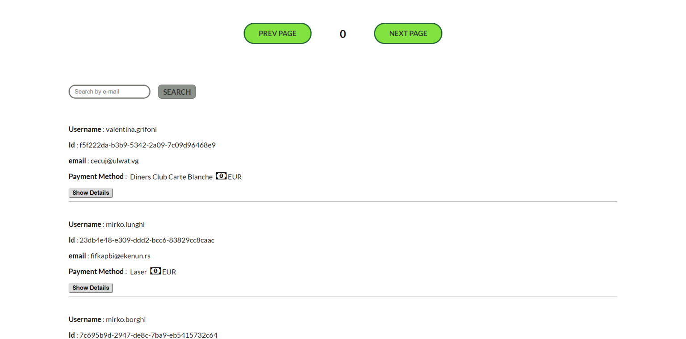

# Payment Methods

## Summary

React SPA showing users data fetching them from an existing API

## Features

* When first loading the application you will see the data about 50 users
* Change the page to see the next or the previous 50 users
* Search a single user using his/her email address
* Clicking the "Show Details " button you will additional user info

## TODO
* Create a sorting menu
* Reload the page automatically when errors from the back-end happen

